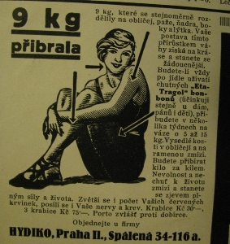

# Úvod

V posledních měsících jsem strávil čtením komentářů na Facebooku mnohem více času, než bych mohl kdykoliv připustit. Když se po uzavření škol začaly objevovat komentáře, že nám vyroste hloupá generace, tak mi tyto obavy přišly velmi neopodstatněné. Z komentářů to vypadalo, že už to horší být nemůže.

Jedním z největších problémů našich předků bylo zajištění dostatku energie na všechny potřebné aktivity. Pokud si čtete tento text, tak během posledních [čtyř miliard roků](https://cs.wikipedia.org/wiki/Posledn%C3%AD_univerz%C3%A1ln%C3%AD_spole%C4%8Dn%C3%BD_p%C5%99edek) se to všem vašim předkům podařilo. Každý z nich to dokázal. Stačila jim k tomu jednoduchá strategie. Pokud se dostaneš ke zdroji energie, preferuj ten s vyšší hustotou, nasbírej ji co nejvíce. Díky tomu nám sladká a tučná jídla chutnají dobře.

I když tato strategie byla velmi úspěšná během posledních čtyř miliard roků a ještě ve 20. letech 20. století se prodávaly bombóny na tloustnutí \(podvyživení lidé umírali mnohem častěji na tuberkulozu\), tak dnes již tomu tak u nás není.

V České republice skoro 20% lidí obezita ohrožuje a průmerný BMI index je na úrovni obezity. To komplikuje život nejen lidem samotným, ale způsobuje to jejich předčasná úmrtí. To má i ekonomické dopady na společnost samotnou. Léčba jednoho pacienta s cukrovkou stojí více než [ tisíc korun měsíčně](https://socialnipolitika.eu/2019/11/naklady-na-lecbu-lidi-s-cukrovkou-vzrostly-za-pet-let-temer-o-petinu-duvodem-je-zejmena-pristup-k-modernim-lekum/) a při tom prevence je velmi levná.

Aby se tomu zabránilo, tak by stačilo, aby si každý ze školy zapamatoval - "Hýbej se. Jez ovoce a zeleninu. Sladkosti jenom občas.". Z toho, že se tuto myšlenku nepovedlo školství předat během 13 let vzdělávání, tak se 

[https://www.czso.cz/csu/stoletistatistiky/jak-jsou-na-tom-cesi-s-chudobou-obezitou-ci-sportovanim](https://www.czso.cz/csu/stoletistatistiky/jak-jsou-na-tom-cesi-s-chudobou-obezitou-ci-sportovanim)

## Doba strávená ve škole

Pro dokončení základní a střední školy je v ní potřeba odsedět 13 roků x 9 měsíců \* 20 dnů \* 5 vyučovacích hodin \* 45 minut = 877h = 365.6 dnů. Jeden celý rok. To je obrovské množství času. Po jednom roce nepřetržitého výkladu by měl být takový člověk schopen vyznat se v komplikovaném světě. Podle komentářů to tak nevypadalo ani náhodou.

Kolik času je tedy potřeba? Je ho potřeba více? Je ten čas efektivně využit? Paretův princip říká, že 80% důsledků plyne z 20% příčin. Toto platí v ekonomii - 20% nejbohatších lidí vlastní 80% půdy, pár nejúspěšnějších produktů je zodpovědných za většinu prodejů. Ve sportu pár nejlepších hráčů nasbírá většinu všech gólů/bodů/výher.

Může něco takového platit i pro množství vědomostí, které jsou potřeba pro zvládnutí života v informačním věku?

## Rady do života

Pokud by se u vás doma najednou objevil váš předek z 15. století, jaké rady byste mu dali, aby dlouho žil? Moje rady by byly takovéto:

1. Když chceš přejít cestu, tak preferuj podchody a nadchody. Pokud tam nejsou, tak použij přechod.
2. Po přechodě přejdi, když po něm jdou další lidé. Pokud tam nejsou lidé, tak přejdi, pokud svítí zelený panáček. Pokud tam nesvítí žádný panáček, tak přejdi, když nejede žádný dopravní prostředek.
3. Myj si ruce. Myj si je po příchodu domů, po použití WC a před jídlem.
4. Čisti si zuby - minimálně ráno a večer. Klidně i po každém jídlě.
5. Nenič své okolí.
6. Jez zdravě - hodně ovoce a zeleniny. Tučné, sladké a slané potraviny jez zřídka.
7. Sportuj. I chůze po venku každý den stačí.

I těchto sedum jednoduchých rad, které se dají vysvětlit a pochopit za jedno odpoledne, by mu výrazně zvýšily šanci na dožití se vysokého větu v dobré kondici. I když nejsou nijak komplikované, tak celá řada z nás má s nimi potíže.

## Odkazy

* Paretův princip - [https://cs.wikipedia.org/wiki/Paret%C5%AFv\_princip](https://cs.wikipedia.org/wiki/Paret%C5%AFv_princip)

