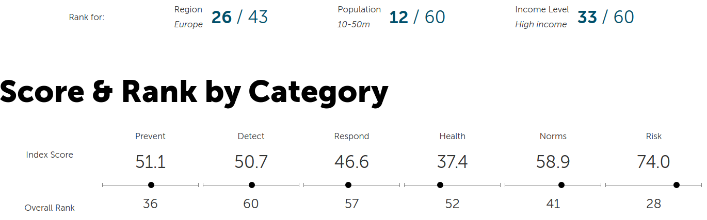

# O viru

## Koronaviry

[Koronavirus](https://cs.wikipedia.org/wiki/Koronavirus) je označení pro čtyři rody virů. Je známo 7 druhů koronavirů, které napadají člověka. Některé způsobuji nachlazení jiné jsou mnohem nebezpečnější - MERS-CoV, SARS-CoV a SARS-CoV-2.

Virus SARS-CoV způsobuje onemocnění [SARS](https://cs.wikipedia.org/wiki/SARS). Znám od roku 2002 z Číny. Rozšířen do 30 zemí. Od roku 2004 není žádný nový případ. 8500 nakažených, 11% zemřelo.

Virus [MERS-CoV](https://cs.wikipedia.org/wiki/MERS) způsobuje onemocnění MERS. Znám od roku 2012 z Arabského poloostrova. Doposud 2500 případů, 35% zemřelo.

Virus [SARS-CoV-2](https://cs.wikipedia.org/wiki/SARS-CoV-2) \(původní prozatimní název 2019-nCov\) způsobuje onemocnění COVID-19. Znám od roku 2019 z Číny. Do 30. listopadu se nakazilo 63 milionů lidí, 2,3% zemřelo.

## Další viry

[Rhinoviry](https://cs.wikipedia.org/wiki/Rhinovirus) jsou nejběžnější a nejinfekčnější viry způsobující [nachlazení](https://cs.wikipedia.org/wiki/Nachlazen%C3%AD). Nachlazení je způsobováno 200 různými druhy virů.

[Ebola](https://cs.wikipedia.org/wiki/Ebola) je virové onemocnění ze skupiny krvácivých horeček se smrtností 50-90%. Poslední [epidemie Eboly](https://cs.wikipedia.org/wiki/Epidemie_eboly_v_z%C3%A1padn%C3%AD_Africe) proběhla v Africe mezi roky 2013 až 2016. Z 28000 nakažených jich 11000 zemřelo. Smrtnost tedy byla okolo 40%.

[Zika](https://cs.wikipedia.org/wiki/Zika_virus) je virus, který způsobuje horečku Zika. Představuje vysoké riziko pro těhotné ženy, jejimž dětem může způsobit těžkou vývojovou poruchu [mikrocefalii](https://cs.wikipedia.org/wiki/Mikrocefalie), která se projevuje předčasným ukončením růstu mozku. Poslední epiedemie byla mezi léty [2015 až 2016](https://en.wikipedia.org/wiki/2015%E2%80%932016_Zika_virus_epidemic), kdy WHO vyhlásila globální stav nouze.

## Připravenost na boj s epidemii

Z historických dat MERS 2012, Ebola 2013-2016, Zika 2015-2016 je vidět, že epidemie nemocí se vyskytují, a že s narůstající propojeností se také zvyšuje šance, že se takové onemocnění rozšírí po světe.

Proto WHO v roce 2019 vypracovala [Global Health Security Index](https://www.ghsindex.org/) pro 195 zemí, kde na základě 140 otázek ohodnotila, jak je která země připravená na zvládnutí globální pandemi. Článek o studii vyšel na [iDnesu](https://www.idnes.cz/zpravy/zahranicni/pripravenost-na-pandemie-zebricek-statu-nuclear-threat-initiative-ebola-chripka-antrax.A191025_123315_zahranicni_kha), detailní výsledky jsou přímo na stránkách [indexu](https://www.ghsindex.org/country/czech-republic/).

## Pozorování

Při pohledu na klasifikaci koronaviru [SARS-CoV-2](https://cs.wikipedia.org/wiki/SARS-CoV-2) a chřipky [H1N1](https://cs.wikipedia.org/wiki/Ch%C5%99ipkov%C3%BD_virus_A_subtypu_H1N1) zjistíme, že mají společnou říší. To například u [člověka](https://cs.wikipedia.org/wiki/%C4%8Clov%C4%9Bk_moudr%C3%BD) znamená živočichové. Takže i [sumka](https://cs.wikipedia.org/wiki/Sumky) a člověk jsou si více podobní než koronavirus a chřipka.

Stejně tak jako není dobré různá plemena psů - pitbull vs čivava - aby člověk věděl, jak nebezpečný bude případné napadení, tak se vyplatí znát a rozlišovat jednotlivé druhy virů.

