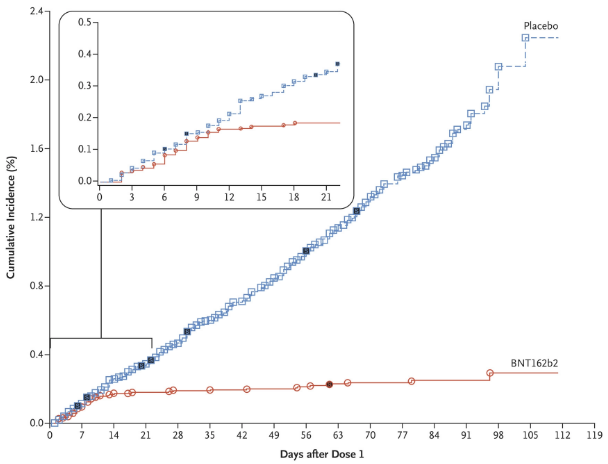

# Pfizer & BioNTech

* Název: Tozinameran
* Kódové označení: BNT162b2
* Obchodní název: Comirnaty
* Typ vakcíny: mRNA

## Shrnutí

* [Comirnaty přehledně od SÚKL](https://www.sukl.cz/sukl/comirnaty-prehledne-dulezita-fakta-o-prvni-podminecne)
* [Proč byl registrován v EU](https://www.ema.europa.eu/en/documents/overview/comirnaty-epar-medicine-overview_cs.pdf)
* [Informace o přípravku](https://ec.europa.eu/health/documents/community-register/2020/20201221150522/anx_150522_cs.pdf)

## Výsledky

Následující výsledky jsou ze zprávy od FDA, kterou schválila její použití v USA - [https://www.fda.gov/media/144416/download](https://www.fda.gov/media/144416/download). Určitě se vyplatí tuto zprávu alespoň zběžně prohlédnout. Ve zprávě jsou data do 14. ledna 2020.

Celkový počet participantů ve fázi 2/3 byl 43,448, 94,2% lidí s vakcínou a 94,1% lidí s placebem obdrželo obě dvě dávky.

### Efektivita po skupinách

| Podskupina | BNT162b2 \(18.198 lidí\) \(onemocnělo/celkem\) | Placebo \(18.325 lidí\) \(onemocnělo/celkem\) | Účinnost \(95% CI\) |
| :--- | :--- | :--- | :--- |
| Celkem | 8 / 17.411 | 162 / 17.511 | 95,0 \(90,0 - 97,9\) |
| Věk - 16-55 | 5 / 9.897 | 114 / 9955 | 95,6 \(89,4 - 98,6\) |
| Věk - &gt;55 | 3 / 7.500 | 48 / 7.543 | 93,7 \(80,6 - 98,8\) |
| Věk - ≥65 | 1 / 3.848 | 19 / 3.880 | 94,7 \(66,7 - 99,9\) |
| Věk - ≥75 | 0 / 774 | 5 / 785 | 100,0 \(-13,1 - 100,0\) |
| Pohlaví - Muž | 3 / 8.875 | 81 / 8.762 | 96,4 \(88,9 - 99,3\) |
| Pohlaví - Žena | 5 / 8.536 | 81 / 8.749 | 93,7 \(84,7 - 98,0\) |
| Komorbidita - Bez | 4 / 9.381 | 76 / 9842 | 94,7 \(85,9 - 98,6\) |
| Komorbidita - Ano | 4 / 8.030 | 86 / 8.029 | 95,3 \(87,7 - 98,8\) |
| Komorbidita - Rakovina | 1 / 704 | 4 / 681 | 75,7 \(-145,8 -  99,5\) |
| Komorbidita - Kardiovaskulární | 0 / 534 | 5 / 492 | 100,0 \(-0,8 - 100.0\) |
| Komorbidita - Chronická plicní nemoc | 1 / 1.374 | 14 / 1.358 | 93,0 \(54,1 - 99,8\) |
| Komorbidita - Diabetes | 1 / 1.372 | 19 / 1.374 | 94,7 \(66,8 - 99,9\) |
| Komorbidita - Obezita \(BMI ≥ 30\) | 3 / 6.000 | 67 / 6.103 | 95,4 \(86,0 - 99,1\) |
| Hypertenze | 2 / 4.413 | 44 / 4.437 | 95,4 \(82,6 - 99,5\) |

### Onemocnění v čase

## Časová posloupnost

* 1. duben 2020 - začátek klinické studie
  2. NCT04368728 - [https://clinicaltrials.gov/ct2/show/NCT04368728](https://clinicaltrials.gov/ct2/show/NCT04368728)
  3. Protokol ke klinické studii - [https://pfe-pfizercom-d8-prod.s3.amazonaws.com/2020-09/C4591001\_Clinical\_Protocol.pdf](https://pfe-pfizercom-d8-prod.s3.amazonaws.com/2020-09/C4591001_Clinical_Protocol.pdf)
* 1. listopad 2020 - oznámení výsledků 3. fáze klinického testování
  2. [https://www.pfizer.com/news/press-release/press-release-detail/pfizer-and-biontech-conclude-phase-3-study-covid-19-vaccine](https://www.pfizer.com/news/press-release/press-release-detail/pfizer-and-biontech-conclude-phase-3-study-covid-19-vaccine)
* 1. listopad 2020 - podali žádost FDA pro schválení
  2. [https://www.fda.gov/media/144416/download](https://www.fda.gov/media/144416/download)
* 1. prosinec 2020 - FDA \(USA\) schvaluje vakcínu
  2. Podklady pro schůzi - [https://www.fda.gov/media/144246/download](https://www.fda.gov/media/144246/download)
  3. Záznam schůze - [https://www.fda.gov/advisory-committees/advisory-committee-calendar/vaccines-and-related-biological-products-advisory-committee-december-10-2020-meeting-announcement](https://www.fda.gov/advisory-committees/advisory-committee-calendar/vaccines-and-related-biological-products-advisory-committee-december-10-2020-meeting-announcement)
  4. Výsledky schůze - [https://www.fda.gov/media/144416/download](https://www.fda.gov/media/144416/download)
  5. Oznámení o schválení - [https://www.fda.gov/emergency-preparedness-and-response/coronavirus-disease-2019-covid-19/pfizer-biontech-covid-19-vaccine](https://www.fda.gov/emergency-preparedness-and-response/coronavirus-disease-2019-covid-19/pfizer-biontech-covid-19-vaccine)
* 1. prosinec 2020 - MHRA \(UK\) - schvaluje vakcínu:
  2. [https://assets.publishing.service.gov.uk/government/uploads/system/uploads/attachment\_data/file/944544/COVID-19\_mRNA\_Vaccine\_BNT162b2\_\_UKPAR\_\_\_PFIZER\_BIONTECH\_\_15Dec2020.pdf](https://assets.publishing.service.gov.uk/government/uploads/system/uploads/attachment_data/file/944544/COVID-19_mRNA_Vaccine_BNT162b2__UKPAR___PFIZER_BIONTECH__15Dec2020.pdf)
* 1. prosinec 2020 - EC Schvaluje
  2. [https://ec.europa.eu/commission/presscorner/detail/en/ip\_20\_2466](https://ec.europa.eu/commission/presscorner/detail/en/ip_20_2466)
  3. Detailní informace v Češtině - [https://ec.europa.eu/health/documents/community-register/2020/20201221150522/anx\_150522\_cs.pdf](https://ec.europa.eu/health/documents/community-register/2020/20201221150522/anx_150522_cs.pdf)
  4. Evropská léková agentura \(EMA\) - [https://www.ema.europa.eu/en/medicines/human/EPAR/comirnaty](https://www.ema.europa.eu/en/medicines/human/EPAR/comirnaty)
  5. EMA v češtině - [https://www.ema.europa.eu/en/documents/overview/comirnaty-epar-medicine-overview\_cs.pdf](https://www.ema.europa.eu/en/documents/overview/comirnaty-epar-medicine-overview_cs.pdf)
* 1. prosinec 2020 - Státní ústav pro kontrolu léčiv informuje o schválení
  2. Comirnaty přehledně: Důležitá fakta o první podmínečně registrované vakcíně proti COVID-19 v EU - [https://www.sukl.cz/sukl/comirnaty-prehledne-dulezita-fakta-o-prvni-podminecne](https://www.sukl.cz/sukl/comirnaty-prehledne-dulezita-fakta-o-prvni-podminecne)
  3. Comirnaty přehledně: Důležitá fakta o první podmínečně registrované vakcíně proti COVID-19 v EU - [https://www.sukl.cz/sukl/evropska-agentura-pro-lecive-pripravky-doporucila-udelit-1](https://www.sukl.cz/sukl/evropska-agentura-pro-lecive-pripravky-doporucila-udelit-1)

## Protokoly

* US - NCT04368728 - [https://clinicaltrials.gov/ct2/show/NCT04368728](https://clinicaltrials.gov/ct2/show/NCT04368728)
* EudraCT \(EU\) - 2020-002641-42 - [https://www.clinicaltrialsregister.eu/ctr-search/trial/2020-002641-42/DE](https://www.clinicaltrialsregister.eu/ctr-search/trial/2020-002641-42/DE)
* Protokol C4591001 - [https://pfe-pfizercom-d8-prod.s3.amazonaws.com/2020-09/C4591001\_Clinical\_Protocol.pdf](https://pfe-pfizercom-d8-prod.s3.amazonaws.com/2020-09/C4591001_Clinical_Protocol.pdf)
* Safety and Efficacy of the BNT162b2 mRNA Covid-19 Vaccine - [https://www.nejm.org/doi/full/10.1056/NEJMoa2034577](https://www.nejm.org/doi/full/10.1056/NEJMoa2034577)

