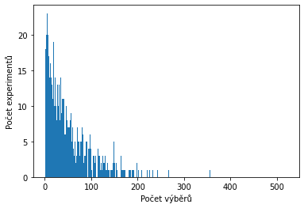

# Vývoj

Na královském dvoře přistane velký, zlý drak a oznámí králi, že přišel nejdříve sežrat jeho jedinou dceru a potom postupně všechny další podanné. Král se nejdřívě vyděsí, ale potom si uvědomí, že by mohl s drakem vyjednávat. Po chvíli vyjednávání se dohodnou, že pokud jsou obyvatelé království chytřejší než drak, tak je nesežere a poletí někam jinam. Zkouška chytrosti bude následující:

Drak si k sobě pozve náhodných 100 lidí z království, kteří k němu budou chodit jeden po druhém. Když k němu člověk přijde, tak drak zamíchá balíček a řekne nějakou kartu. Úkol toho člověka bude říct, na kterém místě v balíčku se vyskytuje. Pokud je to karta, kterou jsme si drak vybral, tak ten člověk přežije. Pokud ne, tak drak balíček znovu zamíchá, řekně novou kartu. Obyvatel se pokusí znovu říct, kde se v balíčku vyskytuje. Takhle se to bude opakovat, dokud tu kartu nenajde. Pokud většina lidí kartu uhádne na první pokus, tak si je drak bude považivat za chytré.

TODO: Spočítat pravděpodobnost, že drak prohraje jenom díky náhodě.

Králi se povede také vyjednat, že než se zkouška uskuteční, tak budou draka krmit dobytkem a princeznu neprovdá.

Král chce nad drakem vyhrát a proto oznámí, že ten, kdo mu připraví zázračný lektvar, který dá lidem schopnost najít kartu v balíčku získá půl království.

### Hodně týmů

Prestiž, sláva a odměna za nalezení takového lektvaru naláká velké množství alchymistických týmů, které se pustí do vývoje lektvaru.

Každý výběr má pravděpodobnost 1:52, že vybere tu správnou kartu. Takže průměrný počet pokusů na nelezení karty bude okolo 52. Občas budeme mít štěstí a naší kartu nalezneme dříve, ale občas budeme mít smůlu a naší kartu nalezneme později.

Pokud 1000 týmů namíchá lektvar, vypije ho, tak potřebný počet výběrů na nalezení vypadá takto:

V tomto konkrétním případě 18 týmů mělo štěstí a kartu se jim povedlo najít hned prvním pokusem. Největší smolaři našli kartu až 522. výběrem. Průměrný počet výběrů byl 51,81. Čtvrtina týmů našla kartu za méně než 17 výběrů a polovinu týmů našla svoji kartu za méně než 37 pokusů.

Pokud nějaký tým našel kartu hned prvním výběrem, tak to neznamená, že podváděl. Taky to není důkaz toho, že draka do království nalíkali, domluvili se s ním na úkolu, aby si mohli připravit lektvar s předstihem.

## Paralelní postup

Chvíli po tom, co král oznámil svoji soutěž, tak se k němu na hrad dostaví první tři úspěšní řešitelé, kteří mají následující výsledky:

| Tým | Počet dobrovolníků | Našlo kartu | Ropucha |
| :--- | :--- | :--- | :--- |
| A | 1 | 1 | 0 |
| B | 10 | 7 | 0 |
| C | 100 | 60 | 3 |

Z prvních výsledků vidíme, že lektvary mají i vedlejší účinek, že občas dobrovolníka přemění na ropuchu. Na první pohled to vypadá, že tým A má perfektní lektvar \(všichni dobrovolníci našli kartu a žádný se neproměnil v ropuchu\), tým B má o trochu horší výsledky, zatímco C má nejhorší výsledky.

Naštěstí se král zajímal o matematiku, tak na svůj první dojem nedá a rozhodne se použít [vědeckou metodu](https://cs.wikipedia.org/wiki/V%C4%9Bdeck%C3%A1_metoda) a 

Proto než král určí výherce, tak si ověří 2 věci:

1. Je ten lektvar bezpečný?
2. Skutečně ten lektvar funguje?

[https://colab.research.google.com/drive/1YjOP0Q6EtLlLcN5\_8FTit4LLppoICO0v?usp=sharing](https://colab.research.google.com/drive/1YjOP0Q6EtLlLcN5_8FTit4LLppoICO0v?usp=sharing)

