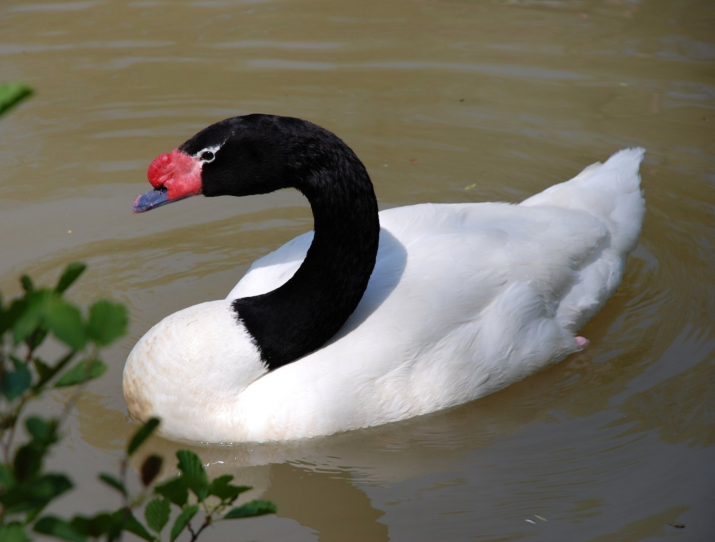

# Imunizace teorie

Tradiční příklad je následující: Mám teorii - "Všechny labutě jsou bílé". Dozvím se, že někdo pozoroval černou labuť. A teď mám 2 možnosti: 

1. Změním svoji teorii, protože existují i černé labutě. Takže moje nová teorie bude - "Labutě jsou převážně bílé, ale existují i černé". Pokud to udělám, tak se můžu ptát na celou řadu otázek - Proč jsou černé? Kde se vyskytují? Jsou místa, kde jsou hlavně černé labutě? Liší se bílé a černé labutě i něčím jiným než barvou? Existují labutě ještě jinak zbarvené? Díky takovým otázkám je možné získat lepší pochopení světa. 
2. Zachovám si svoji teorii, že všechy labutě jsou bílé. O tom černém zvířeti budu tvrdit, že to není labuť, ale úplně nový druh ptáka, který by se mohl jmenovat labůk. Takže můj svět je pořád stejný a nemusím nic měnit.

Lidi, co zvolí druhou možnost se vyřadí z diskuze s první skupinou. Pokud první skupina diskutuje, jak nejlépe evidovat výskyt černých labutí, tak návrh, že to nemá smysl, protože černé labutě neexistují, nemá žádnou hodnotu.

Výhoda toho druhé postupu je, že se dá používat opakovaně. Takže človek měl, má, a vždycky bude mít pravu a nikdy se nezmýlil. Takže i tvrzení - "Všechny květiny jsou růže." - se stane pro daného člověka pravdivé, když bude o čemkoliv jiném tvrdit, že je to plevel a né květina.

