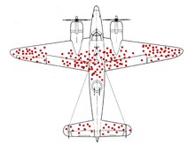
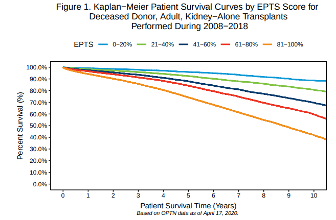

# Plánování


## Spojenci během 2. světové války

### Enigma

### Odhad počtu tanků

Pokud víte, kolik tanků vyrobil váš nepřítel, víte, kolik jste mu jich zničili, tak si snadno můžete dopočítat, kolik tanků mu zbýva. Tento problém se nazývá - Problem Německých Tanků \(German Tank Problem\). 

Němci jsou precizní, takže na všech součástkách mají seriová čísla, která začínají od jedničky. Po bitvě zůstanou na poli 4 zničené tanky se seriovými čísly 19, 40, 42 a 60. A váš úkol je určit, kolik tanků Němci vyrobili. Určitě jich bylo alespoň 60, kolik jich může být maximálně? Dá se to odhadnout? Pokud se použije frekventistické statistika \(jednodušší\), tak je odhad 74. Bayesovské statistika \(komplikovanější\) odhadne, že medián bude 74,5 a průměr bube 89.

Rozvědka si myslela, že Němci vyrábějí okolo tisícovky tanků měsíčně. Odhady statistiků byly mnohem menší. Když se po válce dostali k německým záznamům, tak zjistili, že statistické odhady byly velmi přesné.

| Měsíc | Statistici | Rozvědka | Záznamy |
| :--- | :--- | :--- | :--- |
| Červen 1940 | 169 | 1000 | 122 |
| Červen 1941 | 244 | 1550 | 271 |
| Srpen 1942 | 327 | 1550 | 342 |

Pomocí této metody můžete mít velmi dobrý přehled o počtu všech vyrobených součástek - kola, motory, převodovky, ... A z nich můžete odhadnout celkový počet různých druhů vojenské techniky - tanků, náklaďáků, letadel a raket.

### Double-Cross Systém

Operace[ Systém Dvojitý-Kříž](https://en.wikipedia.org/wiki/Double-Cross_System#V-weapons_deception) \(XX System\) byla protišpionážní operace, jejimž cílem bylo podávat prostřednictvím německých špiónů v Británii dezinformace jejich řídícím důstojníkům v Německu.

Britové si všimli, že rakety V-1 padají 3-5km před Trafalgarským náměstím. Němci pro hlášení míst dopadu využívali své agenty. Britové díky kontrole německých agentů hlásili nadsazená čísla dopadů za centrem Londýna a snižovali počet dopadů před jeho centrem. Kvůli tomu Němci bombardovali hlavně předměstí Londýna místo centra.

Když Němci dostali falešnou informaci, že raketa způsobila velké škody v přístavu u Kanálu, tak změnili svoji bombardovací strategii, a začali útočit na přístavy. Britové jim hlásili těžké ztráty v přístavech. Díky tomu zachránili stovky londýňanů týdně za cenu pár životů v přístavech. Když se o tom válečný kabinet dozvědel, tak Morrison byl proti, protože nepovažoval za správné rozhodovat o tom, kdo má a nemá žít. [R. V. Jones](https://en.wikipedia.org/wiki/Reginald_Victor_Jones) toto rozhodnutí ignoroval, protože ho nedostal písemně a pokračovali ve falešných hlášeních.

### Poškození letadel

Během bombardovacích náletů byla část bombardérů zničena a část se jich vrátila poškozená. Aby zjistili, kde přidat pancéřování, tak provedli analýzu poškození letadel, který se vrátila. Výsledky analýzy vidíte na následujícím obrázku. Kam byste přidali pancéřování?



Pokud vás napadlo, že nejlepší by bylo přidat pancéřování tam, kde je letadlo nejvíce poškozené, tak jste dospěli ke stejnému záměru jako americká armáda. Naštěstí pro ně měla Amerika také SRG \(Statistical Research Group, Statistickou Výzkumnou Skupinu\) a v ní [Abrahama Walda](https://en.wikipedia.org/wiki/Abraham_Wald), který si uvědomil, že ve zkoumaném vzorku chybí letadla, která se nevrátila. Pokud střelba poškodila kabinu nebo motory, tak letadlo zhavarovalo, zatímco poškození křídel umožnilo letadlu doletět zpět. Proto Wald navrhnul přidat pancéřování tam, kde žádné poškození nebylo.

Podobná situace nastala také během první světové války. Když byly zavedeny helmy, tak v polních nemocnicích nastal velký nárůst vojáků se zraněním hlavy. To vedlo armádu k přehodnocení designu helmy. Naštěstí si statistici uvědomili, že nárůst je způsoben vojáky, kteří by to bez helmy nepřežili.

## Ostatní

## 

### Transplantování ledvin

Po celém světě je mnohem větší poptávka po ledvinách, než je jejich nabídka. Aby ledvina přinesla co největší užitek, tak by jí měl jeho příjemce, který s ní přežije nejdéle. K tomuto účelu v USA používají EPTS \(Estimated Post-Transplant Survival, Odhadovné potransplantační přežití\) skóre, které odhaduje, jak dlouho daný člověk po transplantaci přežije. Vzoreček pro jeho výpočet vznikl tak, že se podívali na vztah mezi jejich zdravotním stavem v době transplantace a dobou přežití po transplantaci.

```text
skore = (
    0,047 * max(Věk − 25)          − 0,015 * MáDiabetes * max(Věk - 25)
  + 0,398 * MáJižTransplantaci     − 0,237 * MáDiabetes * MáJižTransplantaci
  + 0,315 * log(RokůNaDialýze + 1) − 0,099 * MáDiabetes * log(RokůNaDialýze + 1)
  + 0,130 * (RokůNaDialýze = 0)    − 0,348 * MáDiabetes * (RokůNaDialýze = 0) 
  + 1,262 * MáDiabetes
```

Kde `MáDiabetes` a `MáJižTransplantaci` jsou 1, pokud jsou pravda, jinak 0. `RokůNaDialýze = 0` je 1, pokud člověk nikdy nebyl na dialýze, jinak 0. Při pohledu na ten vzoreček vás určitě napadlo, že i jiné faktory by mohly mít vliv.  Ale při návrhu podobného systému je vždycky lepší zvolit jednodušší verzi i za cenu drobného zhoršení.



## Pfizer


Očkovací kampaň

## Česká historie

Ve svém vzdělání jsem tříkrát probral starověk, dvakrát středověk, ale nikdy jsem se nedostal do 20. století. Netuším, jestli máme v české historie nějaké příklady, kdy jsme si něco dobře naplánovali nebo spočítali, a podle toho jsme se rozhodli.


## Odkazy

### German Tank Problem

* German Tank Problem - [https://en.wikipedia.org/wiki/German\_tank\_problem](https://en.wikipedia.org/wiki/German_tank_problem)
* An Empirical Approach to Economic Intelligence in World War II - [http://people.math.gatech.edu/~weiss/uploads/5/8/6/1/58618765/brodie\_an\_empirical\_approach\_to\_economic\_intelligence\_in\_world\_war\_ii.pdf](http://people.math.gatech.edu/~weiss/uploads/5/8/6/1/58618765/brodie_an_empirical_approach_to_economic_intelligence_in_world_war_ii.pdf)

### Double-Cross System

* Double-Cross System - V-weapons deception - [https://en.wikipedia.org/wiki/Double-Cross\_System\#V-weapons\_deception](https://en.wikipedia.org/wiki/Double-Cross_System#V-weapons_deception)
* Reginald Victor Jones - [https://en.wikipedia.org/wiki/Reginald\_Victor\_Jones](https://en.wikipedia.org/wiki/Reginald_Victor_Jones)

Poškození letadel

* The Statistical Research Group, 1942–1945 - [https://doi.org/10.1080/01621459.1980.10477469](https://doi.org/10.1080/01621459.1980.10477469)
* Abraham Wald - [https://en.wikipedia.org/wiki/Abraham\_Wald](https://en.wikipedia.org/wiki/Abraham_Wald)
* Survivorship bias - [https://en.wikipedia.org/wiki/Survivorship\_bias](https://en.wikipedia.org/wiki/Survivorship_bias)

### Transplantace ledvin

* EPTS - [https://optn.transplant.hrsa.gov/media/1511/guide\_to\_calculating\_interpreting\_epts.pdf](https://optn.transplant.hrsa.gov/media/1511/guide_to_calculating_interpreting_epts.pdf)
* EPTS Kalkulačka - [https://www.mdapp.co/estimated-post-transplant-survival-epts-score-calculator-332/](https://www.mdapp.co/estimated-post-transplant-survival-epts-score-calculator-332/)

Pfizer

* SÚKL - [https://www.sukl.cz/sukl/prehled-hodnocenych-leciv-na-nemoc-covid-19](https://www.sukl.cz/sukl/prehled-hodnocenych-leciv-na-nemoc-covid-19)

